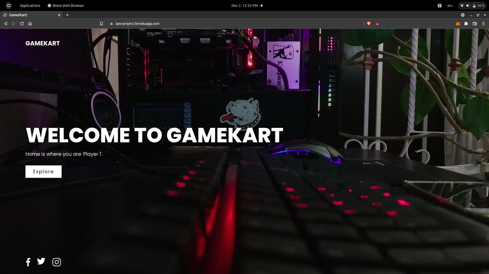
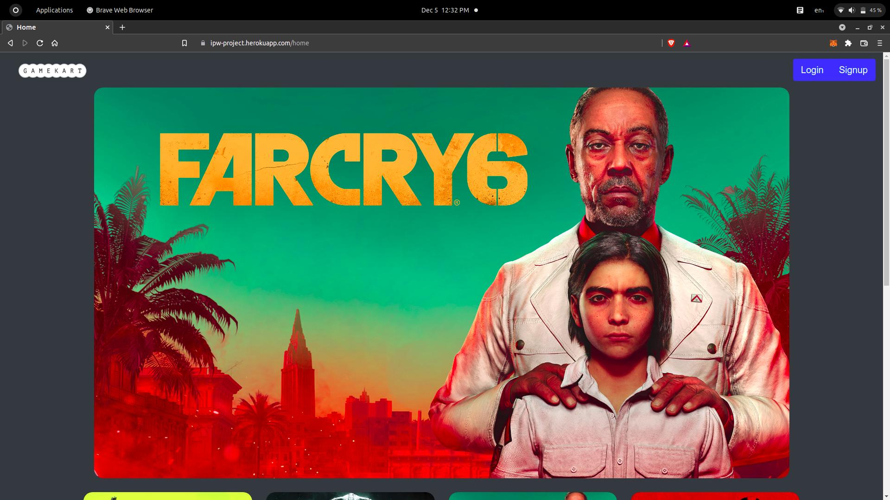
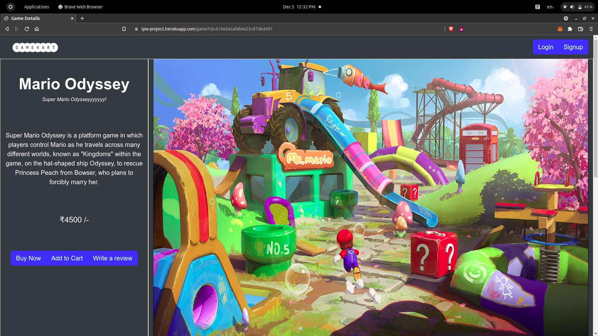
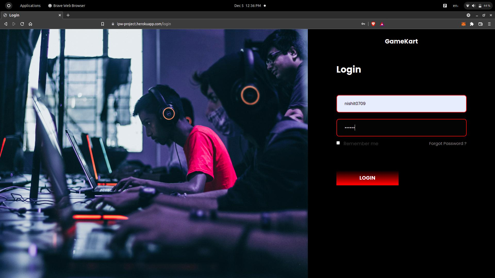
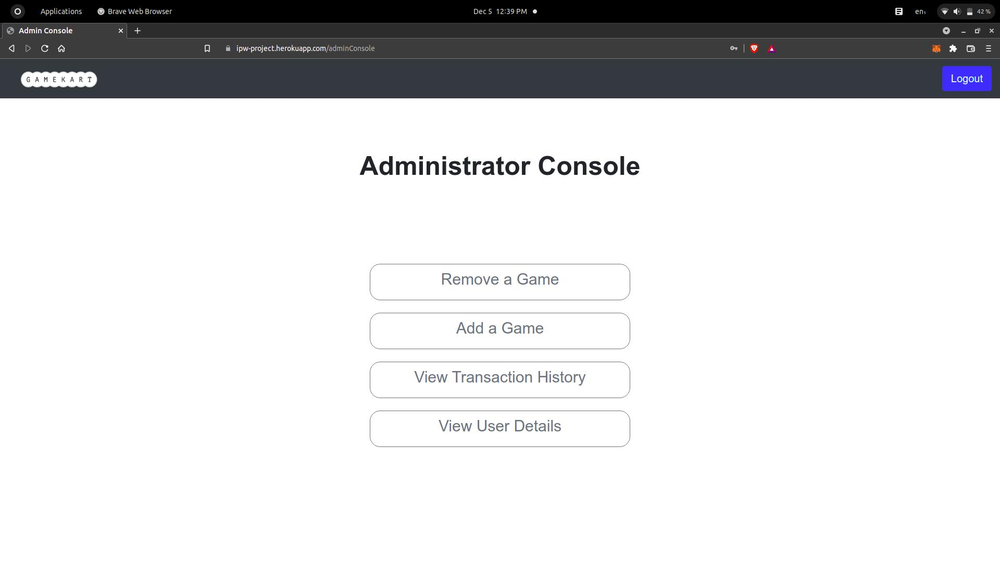
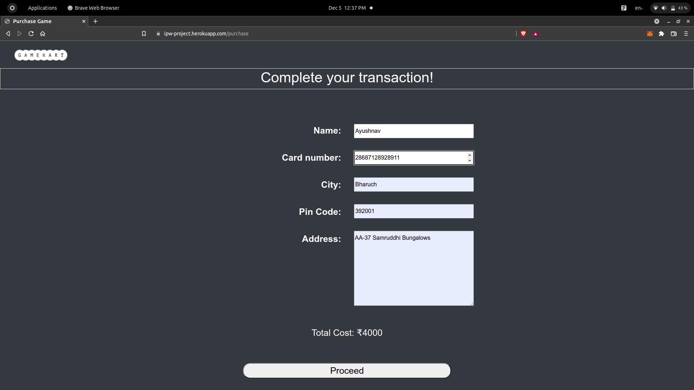

# GameKart

## Description
GameKart is an online video game store management system. It is easy to use, has a simple and intuitive UI and has various functionalities to make it easy and efficient for the businesses to use it.

**Features of Gamekart**
- Visually Appealing design and website layout
- Separate user and admin accounts
- Admins users can modify website to add new games and view transactions
- Users can give reviews and purchase games by after adding them to cart
- Maintainance of transaction history for analytics

## How to deploy the code
Add the the mongodb database server link in the **.env** file and proceed with executing the following commands
- Using NodeJS
    1. `npm install`
    2. `npm run start`

- Using Docker
    1. `docker build . -t <docker image name>`
    2. `sudo docker run -p 4000:4000 -d <docker image name>`

## Output
- Landing Page

- Homepage

- Game description page

- Login page

- Admin console

- Purchase game
